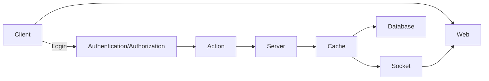

# Live Scoreboard Service Module Specification

# Overview

This module maintains user's scores.
User can do an action, completing this action will increase the user’s score.
Upon completion the action will dispatch an API call to the application server to update the score.
Updating the score required users to be authenticated first.

# API

- GET:/api/v1/scores/top

Description: Get the first 10 top score users

Response Model:

> {
> userId: number
> userName: string
> score: number
> }

- POST:/api/v1/scores/increment

Description: Increase a user's score by 1

Header:

- Authentication

  > JWT [token]

- Payload:
  > {
  > userId: number,
  > timestamp: number
  > }

# Architecture

- Stack
  - Cached memory - Redis
  - Socket

Redis to avoid database overloaded.

Socket to send real time data to browsers.

# Workflow

